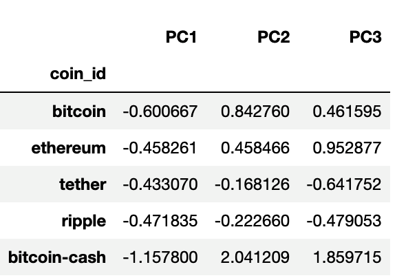

# Cryptocurrencies Clustering

I predict if cryptocurrencies are affected by 24-hour or 7-day price changes using Python and unsupervised learning

## Prepare the Data
- Use the StandardScaler() module from scikit-learn to normalize the data from the CSV file.

```
    market_data_scaled=StandardScaler().fit_transform(df_market_data[["price_change_percentage_24h","price_change_percentage_7d","price_change_percentage_14d","price_change_percentage_30d","price_change_percentage_60d","price_change_percentage_200d","price_change_percentage_1y"]])

```


## Find the Best Value for k Using the Original Data.


## Cluster Cryptocurrencies with K-means Using the Original Scaled Data
- Initialize the K-means model with the best value for k.
- Fit the K-means model using the original scaled DataFrame.
- Predict the clusters to group the cryptocurrencies using the original scaled DataFrame.
- Create a copy of the original data and add a new column with the predicted clusters.
- Create a scatter plot using hvPlot.


## Optimize Clusters with Principal Component Analysis
- Using the original scaled DataFrame, perform a PCA and reduce the features to three principal components.
- Retrieve the explained variance to determine how much information can be attributed to each principal component
```
pca.explained_variance_ratio_
=> array([0.3719856 , 0.34700813, 0.17603793])
```
- Create a new DataFrame with the PCA data and set the "coin_id" index from the original DataFrame as the index for the new DataFrame.


## Find the Best Value for k Using the PCA Data
- Create a list with the number of k-values from 1 to 11.
- Create an empty list to store the inertia values.
- Create a for loop to compute the inertia with each possible value of k.
- Create a dictionary with the data to plot the Elbow curve.
- Plot a line chart with all the inertia values computed with the different values of k to visually identify the optimal value for k.


## Cluster Cryptocurrencies with K-means Using the PCA Data
- Initialize the K-means model with the best value for k.
- Fit the K-means model using the PCA data.
- Predict the clusters to group the cryptocurrencies using the PCA data.
- Create a copy of the DataFrame with the PCA data and add a new column to store the predicted clusters.
- Create a scatter plot using hvPlot 


### After examining the cluster analysis results visually, the values within each cluster in the PCA analysis are much closer together and easier to distinguish compared to those in the original data. In particular, the PCA method was able to separate celsius-degree-token and ethlend more effectively.